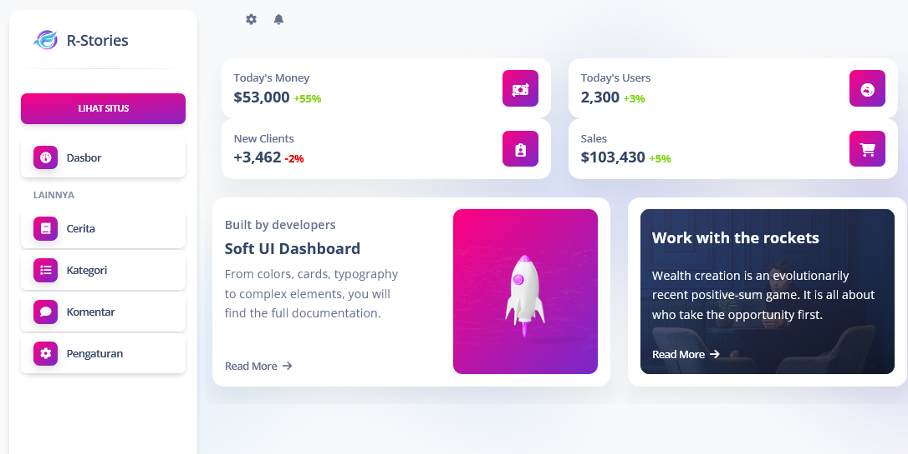

# Wattpad EvolveJS




### Install

- Import `database.sql` di phpMyAdmin.
- Konfigurasi database `core/Database.js`
```
  host: 'localhost',
  user: 'root',
  password: '',
  database: 'demo'
```
- Install dependencies `npm install`
- Jalankan `npm run dev:tw` atau `npm start`
- Dashboard admin: `http://localhost:3000/dashboard`